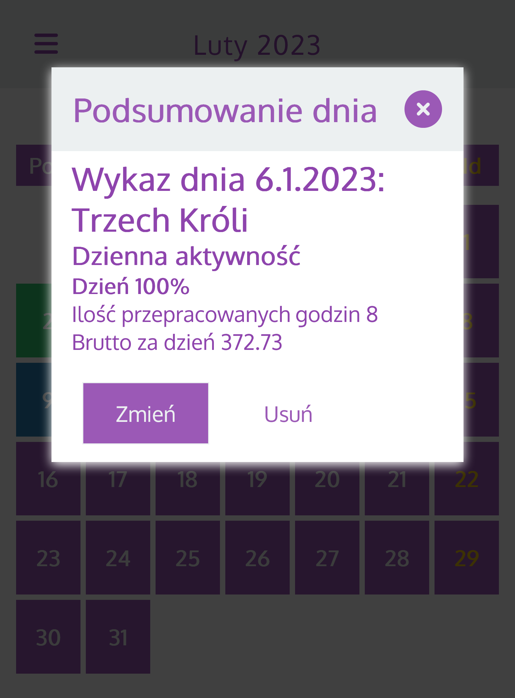

# paymentapp

## Your private work calendar

Try it on mobile: https://paymentapp-e4f92.web.app/

## Check your each work presention




## Set your profile for payment info calculating


## Project setup

```
yarn
```

### Compiles and hot-reloads for development

```
yarn run serve
```

### Compiles and minifies for production

```
yarn run build
```

### Run your unit tests[in progress]

```
yarn run test:unit
```

### Lints and fixes files

```
yarn run lint
```
